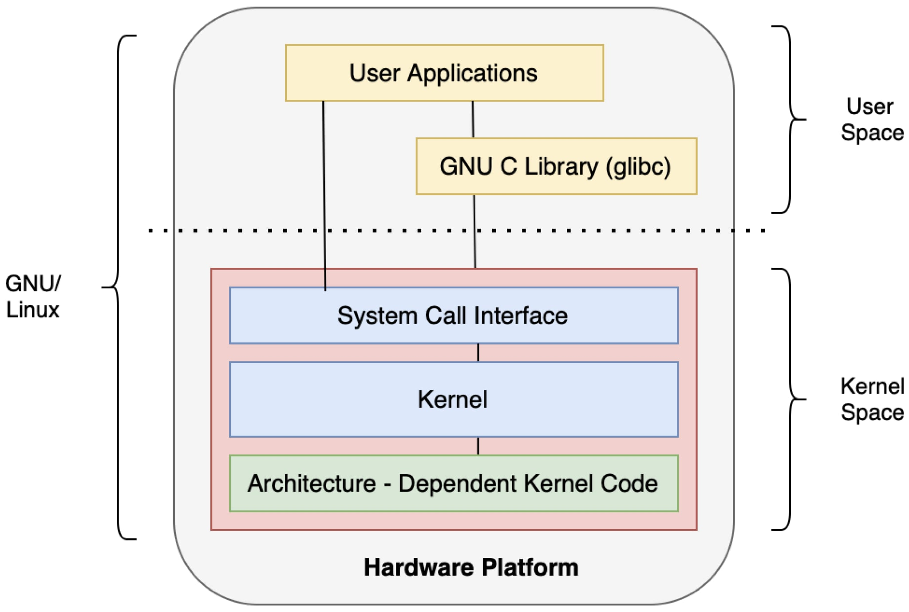

# LEARN FILE SYSTEM
## Mô Hình System Call và Kiến Trúc Linux Kernel


1. Giới thiệu chung

- Linux là một hệ điều hành đa nhiệm, đa người dùng, với kiến trúc tách biệt rõ ràng giữa User Space (không gian người dùng) và Kernel Space (không gian nhân hệ điều hành). Mô hình này giúp hệ thống an toàn, ổn định và dễ mở rộng.

2. Cấu trúc hệ thống Linux
```
User Space
  ├── User Applications
  └── GNU C Library (glibc)

Kernel Space
  ├── System Call Interface
  ├── Kernel
  └── Architecture-Dependent Kernel Code

Hardware Platform
```

- User Space: nơi chạy ứng dụng người dùng, không truy cập trực tiếp phần cứng.
- Kernel Space: nơi chạy nhân Linux, quản lý phần cứng, bộ nhớ, tiến trình, hệ thống file, ...
- Hardware Platform: CPU, RAM, thiết bị ngoại vi...

3. Không gian User Space và Kernel Space
- User Space:
Chạy các ứng dụng, chương trình như trình duyệt, terminal, editor...
Ứng dụng không thể truy cập trực tiếp phần cứng hoặc tài nguyên hệ thống quan trọng.
Để làm việc với phần cứng, ứng dụng phải gọi vào system call thông qua glibc.

- Kernel Space:
Chạy nhân Linux, kiểm soát và điều phối tất cả phần cứng, tài nguyên.
Có quyền truy cập trực tiếp và đầy đủ tới phần cứng.
Đảm bảo bảo mật, ổn định hệ thống.

4. Thư viện GNU C (glibc)
- Là thư viện chuẩn ngôn ngữ C trong Linux, cung cấp các hàm chuẩn (printf, read, write, malloc, ...)
- Thư viện này đóng vai trò trung gian, cung cấp giao diện thuận tiện cho ứng dụng gọi system call.
- Khi app gọi printf, thực chất glibc sẽ gọi write syscall để in ra thiết bị đầu ra.

5. System Call Interface
- Đây là cầu nối giữa User Space và Kernel Space.
- Chịu trách nhiệm chuyển yêu cầu từ ứng dụng sang kernel.
- Đóng vai trò như một API chuẩn để ứng dụng gọi chức năng hệ thống như thao tác file, tạo tiến trình, quản lý bộ nhớ.

6. Kernel
- Nhân hệ điều hành Linux, thực thi các thao tác thực sự trên phần cứng và tài nguyên.
- Bao gồm: quản lý file system, quản lý bộ nhớ, quản lý tiến trình, điều khiển thiết bị...
- Nhận yêu cầu từ System Call Interface, xử lý và trả kết quả cho user space.

7. Phần phụ thuộc kiến trúc Kernel
- Đây là phần cụ thể với từng kiến trúc phần cứng (x86, ARM, MIPS, ...)
- Đảm bảo kernel có thể chạy trên nhiều nền tảng khác nhau bằng cách xử lý các đặc thù phần cứng riêng biệt.

8. Luồng hoạt động khi gọi system call
- Giả sử ứng dụng gọi:
```
printf("Hi");
read(fd, buf, 10);
```

- Ứng dụng gọi printf → glibc chuyển sang syscall write()
- Syscall đi qua System Call Interface
- Kernel nhận syscall, xử lý yêu cầu write() (gửi dữ liệu ra terminal)
- read(fd, buf, 10) tương tự, gọi syscall read()
- Kernel kiểm tra file descriptor fd, đọc dữ liệu từ thiết bị/file tương ứng
- Kernel trả dữ liệu về cho app qua System Call Interface.

9. Tóm tắt và tổng kết
- User Space chạy ứng dụng, không truy cập trực tiếp phần cứng.
- glibc cung cấp hàm chuẩn và gọi syscall để giao tiếp kernel.
- System Call Interface là cửa ngõ để chuyển yêu cầu từ user sang kernel.
- Kernel xử lý các yêu cầu, điều khiển phần cứng, quản lý tài nguyên.
- Kiến trúc tách biệt giúp Linux ổn định, an toàn và dễ bảo trì.
