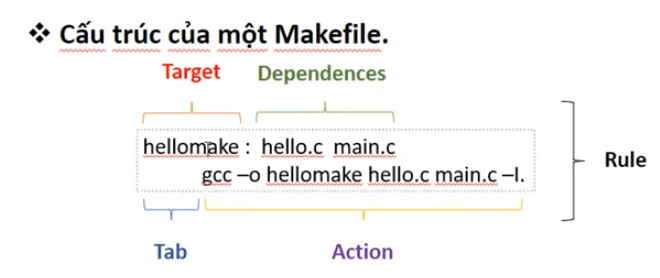

# LEARN MAKEFILE
## Cấu Trúc Makefile


- **Target** (`hellomake`)  
  Là tên file hoặc hành động bạn muốn tạo ra (ví dụ: file thực thi, hoặc tên rule).

- **Dependencies** (`hello.c main.c`)  
  Là các file mà target phụ thuộc, nếu các file này thay đổi, target sẽ được xây dựng lại.

- **Tab** (ký tự thụt lề đầu dòng)  
  Dòng lệnh trong rule **phải bắt đầu bằng Tab**, không dùng dấu cách, đây là quy tắc bắt buộc trong Makefile.

- **Action** (`gcc -o hellomake hello.c main.c -l`)  
  Các lệnh thực thi để tạo ra target từ dependencies (ví dụ: biên dịch, liên kết).

---

### Giải thích thêm

- Khi chạy `make hellomake`, Make sẽ kiểm tra:  
  Nếu `hello.c` hoặc `main.c` mới hơn `hellomake`, hoặc `hellomake` chưa tồn tại → Make sẽ chạy **Action**.

- Nếu `hellomake` đã mới hơn các dependencies, Make sẽ bỏ qua bước build.

---

> **Lưu ý:**  
> Các dòng lệnh (Action) trong rule phải **bắt đầu bằng phím Tab**, không dùng spaces thay thế, nếu không Make sẽ báo lỗi.

## Makefile Variable Assignment Notes

### Mục đích
Makefile này dùng để minh họa **sự khác nhau giữa các kiểu gán biến trong GNU Make**
và **thời điểm biến được expand**.

---

### Các kiểu gán biến

- `=` (recursive variable)  
  → Giá trị được **mở rộng khi sử dụng**

- `:=` (simple variable)  
  → Giá trị được **mở rộng ngay lúc gán**

- `?=` (conditional assignment)  
  → Chỉ gán nếu biến **chưa tồn tại**

---

### Ví dụ

```make
var := "var"
var3 := "var3"

var1 = ${var}
var2 := ${var}
var3 ?= ${var}

var := "changed_var"

Output:
"changed_var"   # var1 dùng '=' (biến đệ quy) -> bất cứ khi nào var thay đổi giá trị thì var1 cũng thay đổi theo
"var"           # var2 dùng ':=' (biến cố định) Giá trị đã được fix từ trước là "var" -> Không bị ảnh hưởng bởi việc var thay đổi
"var3"          # var3 không bị ghi đè bởi '?=' vì var3 đã được gán từ đầu 

Note:
Nếu var3 chưa được gán trước đó, thì nó sẽ hoạt đông như biến đệ quy

Example: 
var := "var"

var1 = ${var}
var2 := ${var}
var3 ?= ${var}

var := "changed_var"

Output:
"changed_var"
"var"
"changed_var"
```

## GNU Make – Makefile Naming and Selection

## 1. Các cách viết Makefile
Trong dự án, bạn có thể tạo Makefile bằng các tên phổ biến sau:

| Tên file             | Ghi chú |
|---------------------|---------|
| `Makefile`           | Tên chuẩn, ưu tiên nhất |
| `makefile`           | Tên thường dùng, ưu tiên thứ 2 nếu `Makefile` không tồn tại |
| `GNUmakefile`        | Tên đặc biệt, ưu tiên cao hơn `makefile` nhưng thấp hơn `Makefile` |

**Chú ý:** Các tên trên là mặc định, bạn **không cần khai báo gì thêm** để chạy `make`.

## 2. Khi gõ lệnh `make`

```bash
make
```
**Ngoài ra:**
File `.mk` trong Make
- `*.mk` thường dùng để **chia nhỏ Makefile** thành module (ví dụ `base.mk`, `dev.mk`, `prod.mk`).
- Make **không tự động chạy `.mk`**, phải dùng:
```bash
make -f dev.mk <target>
```

### 3. Chỉ định Makefile cụ thể
Nếu bạn muốn chạy Makefile khác hoặc nhiều Makefile trong dự án, dùng tùy chọn -f:

```bash
make -f <tên_makefile> <target>

Example:
make -f build.mk all
make -f MyMakefile clean

-f có thể dùng nhiều lần nếu muốn ghép nhiều Makefile:
make -f base.mk -f dev.mk all
```
## `.PHONY` – Bản chất và vai trò trong Makefile

- **Make hoạt động dựa trên file system**: mỗi target trong Makefile được hiểu là một file cần được tạo ra hoặc cập nhật.
- Khi bạn chạy `make <target>`, Make sẽ kiểm tra xem file tên `<target>` có tồn tại và có mới hơn các file phụ thuộc (dependencies) không.
  - Nếu file đã tồn tại và không cần cập nhật, Make sẽ **bỏ qua việc chạy lệnh**.
- Vấn đề xảy ra khi target là một **"tác vụ" (action) chứ không phải file thực** — ví dụ như `clean`, `install`, hoặc các target phụ trợ khác.
  - Nếu trên hệ thống có file hoặc thư mục trùng tên target, Make sẽ nhầm tưởng target đã được thực hiện rồi và **không chạy lệnh** nữa.
- `.PHONY` là cách để **báo cho Make biết rằng target đó không phải file thật**, mà là một tác vụ cần thực thi mỗi khi được gọi.
  - Khi target được khai báo trong `.PHONY`, Make sẽ **bỏ qua việc kiểm tra file trên đĩa** và luôn chạy lệnh tương ứng.
  
### Nói cách khác:

- `.PHONY` chuyển target từ **“file-based”** thành **“command-based”**.
- Nó bảo đảm các tác vụ như `clean`, `all`, `install` luôn được chạy đúng lúc, không bị nhầm với file cùng tên.

---

### Ví dụ minh họa:

```make
.PHONY: clean

clean:
	rm -rf build/
```

## Makefile: Rule Ẩn (Implicit Rule)
# 1. Rule ẩn là gì?

Rule ẩn là các quy tắc mặc định mà make cung cấp để tự động tạo file khi bạn chưa khai báo explicit rule.

Ví dụ: Make biết cách biên dịch main.c thành main.o mà bạn không cần viết rõ.

# 2. Ví dụ rule ẩn
```make
%.o: %.c
	$(CC) -c $< -o $@

% : ký tự đại diện (tên file bất kỳ).

$< : dependency đầu tiên (ví dụ main.c).

$@ : target hiện tại (ví dụ main.o).
```

# 3. Vì sao Make vẫn compile .c thành .o khi không khai báo rule

```make
CC := gcc
CFLAGS := -I.

hellomake: main.o hello.o
	$(CC) -o hellomake main.o hello.o $(CFLAGS)
```

- Khi chạy
```bash
make hellomake
```

- Nếu không có rule tạo main.o và hello.o, Make tự dùng rule ẩn để biên dịch:

```css
gcc -I. -c -o main.o main.c
gcc -I. -c -o hello.o hello.c
```
- Biến CFLAGS tự động được thêm vào.

**Note:** Ví dụ khi thay đổi main.c hoặc hello.c thì khi `make hellomake` nó detect được sự thay đổi của dependency nó sẽ chạy lại rule ẩn build lại `file .o` nhưng mà nếu `hello.h` thay đổi thì nó không detect được sự thay đổi nên không build lại `file .o` nên cần sử dụng rule riêng.

## 4. Khi nào nên viết rule riêng
- Khi cần thêm phụ thuộc khác ngoài .c (ví dụ .h) hoặc flag đặc biệt.
- Example:
```make
%.o: %.c hello.h
	$(CC) -c $< -o $@ $(CFLAGS)
```
- Rule này đảm bảo Make sẽ build lại .o nếu hello.h thay đổi.

## Makefile minh họa cho 4 stage của compiler (C compilation) theo chuẩn
Trong compiler C, 4 stage cơ bản:

- Preprocessing (.i) – xử lý #include, macro, comment…
- Compilation (.s) – chuyển .i thành assembly
- Assembling (.o) – chuyển .s thành object file .o
- Linking (a.out hoặc executable) – kết hợp các .o thành file chạy được

```make
# Compiler và flags
CC := gcc
CFLAGS := -Wall -I.
ASFLAGS :=

# Files
SRC := main.c hello.c
PRE := $(SRC:.c=.i)
ASM := $(SRC:.c=.s)
OBJ := $(SRC:.c=.o)
EXE := hellomake

.PHONY: all clean

# Target chính
all: $(EXE)

# 1️⃣ Linking: từ .o -> executable
$(EXE): $(OBJ)
	$(CC) $(OBJ) -o $@

# 2️⃣ Assembling: từ .s -> .o
%.o: %.s
	$(CC) -c $< -o $@

# 3️⃣ Compilation: từ .i -> .s
%.s: %.i
	$(CC) -S $< -o $@

# 4️⃣ Preprocessing: từ .c -> .i
%.i: %.c
	$(CC) -E $< -o $@

# Xóa file build
clean:
	rm -f $(OBJ) $(PRE) $(ASM) $(EXE)
```

- Tạo file main.c, hello.c
- Chạy:
```bash
make -f Makefile
```
- Nếu muốn build từng stage riêng:
```bash
make main.i       # chỉ preprocessing
make main.s       # chỉ compile -> assembly
make main.o       # chỉ assemble -> object
make hellomake    # build executable
```

**Note:** một cú pháp đặc biệt trong Makefile gọi là “substitution reference” – dùng để chuyển đổi tên file dựa trên mẫu
```make
$(VAR:OLD=NEW)
```
- VAR là danh sách các file hoặc chuỗi.
- Make sẽ thay thế phần OLD cuối mỗi phần tử bằng NEW.
- Kết quả là một danh sách mới.

Ví dụ trong `Makefile`
```make
SRC := main.c hello.c
PRE := $(SRC:.c=.i)
```

- SRC = main.c hello.c
- PRE := $(SRC:.c=.i) → Make sẽ:
- Thay .c bằng .i cho mỗi file trong SRC
- Kết quả: PRE = main.i hello.i

**Ngoài ra:** Ví dụ Cả hello1.c và hello2.c đều định nghĩa cùng 1 hàm hello().

```c
// hello.h
void hello();

// hello1.c
#include "hello.h"
void hello() { printf("Hello1\n"); }

// hello2.c
#include "hello.h"
void hello() { printf("Hello2\n"); }

// main.c
#include "hello.h"
int main() { hello(); return 0; }
```

Trả lời cho câu hỏi tại sao không build ra file thực thi luôn mà phải biên dịch ra file object. Lý do là để linh hoạt trong việc kết hợp các file object lại với nhau thì người ta sẽ build ra file object rồi link lại.

```bash
gcc -c hello1.c -o hello1.o
gcc -c hello2.c -o hello2.o
gcc -c main.c -o main.o
```

Mỗi file object giữ symbol table riêng.
Khi link:
```bash
gcc main.o hello1.o -o app   # hello() từ hello1.o → in ra Hello1
gcc main.o hello2.o -o app   # hello() từ hello2.o → in ra Hello2
```
Điều này giúp:
- Chọn đúng phiên bản hàm
- Tránh lỗi multiple definition
- Linh hoạt trong quản lý project nhiều file