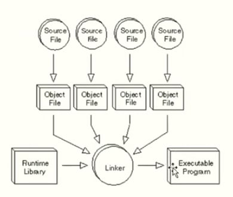

# Static Library và Shared Library


## 1. Static Library (Thư viện tĩnh)

### Khái niệm
Static library là thư viện mà **mã của thư viện được copy trực tiếp vào file thực thi** trong quá trình link.

Sau khi build xong, file thực thi đã chứa đầy đủ mã của thư viện và **có thể chạy độc lập**.

### Cách hoạt động
- Source file → Object file
- Object file + Static library → Linker
- Linker tạo ra file thực thi chứa luôn code của thư viện

### Ưu điểm
- Chạy độc lập, **không phụ thuộc thư viện bên ngoài**
- Không lo thiếu thư viện trên máy khác
- Phù hợp cho chương trình nhỏ, embedded, tool standalone

### Nhược điểm
- File thực thi có **kích thước lớn**
- Khi thư viện thay đổi → **phải build lại chương trình**

---

## 2. Shared Library (Thư viện dùng chung / thư viện động)

### Khái niệm
Shared library là thư viện mà **mã không được copy vào file thực thi**.

Chương trình chỉ **liên kết với thư viện khi chạy (runtime)**.

### Cách hoạt động
- Khi build: file thực thi chỉ ghi thông tin “cần thư viện X”
- Khi chạy: hệ điều hành tìm thư viện trên hệ thống
  - Nếu có → chương trình chạy
  - Nếu không có → lỗi runtime

### Ưu điểm
- File thực thi **nhỏ hơn**
- **Nhiều chương trình có thể dùng chung một thư viện**
- Cập nhật thư viện → các chương trình tự động được hưởng lợi

### Nhược điểm
- Phụ thuộc vào thư viện có tồn tại trên hệ thống hay không
- Dễ xảy ra lỗi thiếu thư viện hoặc sai phiên bản
- Có thể gặp lỗi:
  ```text
  error while loading shared libraries

## 3. Build C Program với Static Library and Shared Library


```makefile
# Build static library
static:
	ar rcs lib/static/libhello.a obj/helloQuan.o obj/helloWorld.o

# Build shared library
shared:
	gcc -fPIC -c src/helloQuan.c -I./inc -o obj/helloQuan.o
	gcc -fPIC -c src/helloWorld.c -I./inc -o obj/helloWorld.o
	gcc -shared -o lib/shared/libhello.so obj/helloQuan.o obj/helloWorld.o

# Link executable với static library
link_static:
	gcc obj/main.o -Llib/static -lhello -o bin/exam

# Link executable với shared library
link_shared:
	gcc obj/main.o -Llib/shared -lhello -o bin/exam

# Biên dịch tất cả .c thành .o
all:
	gcc -c main.c -o obj/main.o -I./inc
	gcc -c src/helloQuan.c -o obj/helloQuan.o -I./inc
	gcc -c src/helloWorld.c -o obj/helloWorld.o -I./inc

# Xóa file build
clean:
	rm -rf obj/* bin/*
```

## 4. Giải thích Makefile

### Target `all`
```makefile
all:
	gcc -c main.c -o obj/main.o -I./inc
	gcc -c src/helloQuan.c -o obj/helloQuan.o -I./inc
	gcc -c src/helloWorld.c -o obj/helloWorld.o -I./inc

Biên dịch các file .c thành .o
-c : chỉ compile, chưa link
-I./inc : chỉ đường dẫn chứa file header
Sau bước này chưa có file thực thi
```

### Target `static`
```makefile
static:
	ar rcs lib/static/libhello.a obj/helloQuan.o obj/helloWorld.o

Tạo static library libhello.a
Gom code từ helloQuan.o và helloWorld.o
Mã thư viện sẽ được dùng khi link
```

### Target `link_static`
```makefile
link_static::
	gcc obj/main.o -Llib/static -lhello -o bin/exam

Link main.o với static library libhello.a
-Llib/static : đường dẫn tới thư viện
-lhello : link với libhello.a
Tạo file thực thi exam
Code thư viện được copy vào file chạy
```

### Target `shared`

```makefile
shared:
	gcc -fPIC -c src/helloQuan.c -I./inc -o obj/helloQuan.o
	gcc -fPIC -c src/helloWorld.c -I./inc -o obj/helloWorld.o
	gcc -shared -o lib/shared/libhello.so obj/helloQuan.o obj/helloWorld.o
    Ý nghĩa từng lệnh:

1. gcc -fPIC -c src/helloQuan.c -I./inc -o obj/helloQuan.o
- Biên dịch helloQuan.c thành file object .o
- fPIC → tạo code position-independent, bắt buộc cho shared library
- I./inc → chỉ định thư mục chứa header .h
2. gcc -fPIC -c src/helloWorld.c -I./inc -o obj/helloWorld.o
- Tương tự, biên dịch helloWorld.c thành object .o
3. gcc -shared -o lib/shared/libhello.so obj/helloQuan.o obj/helloWorld.o
- Gộp các file .o thành shared library libhello.so
- shared → tạo shared library thay vì file thực thi

💡 Kết quả: tạo được lib/shared/libhello.so chứa code của thư viện, nhưng chưa phải chương trình chạy được, phải link với main.
```

### Target `link_shared`
```makefile
link_shared:
	gcc obj/main.o -Llib/shared -lhello -o bin/exam

Ý nghĩa từng phần:
- gcc obj/main.o → file main đã được compile
- Llib/shared → thư mục chứa shared library libhello.so
- lhello → link với thư viện libhello.so (lib + tên + .so)
- o bin/exam → tạo file thực thi exam

💡 Lưu ý: khi chạy ./bin/exam, Linux phải biết đường dẫn tới libhello.so, nếu không sẽ báo lỗi:
error while loading shared libraries: libhello.so: cannot open shared object file: No such file or directory
Giải pháp: set LD_LIBRARY_PATH
export LD_LIBRARY_PATH=lib/shared:$LD_LIBRARY_PATH
```

### Note `LD_LIBRARY_PATH`
```bash
export LD_LIBRARY_PATH=lib/shared:$LD_LIBRARY_PATH
```
1️⃣ Mục đích
- Lệnh này thông báo cho Linux nơi tìm các shared library (.so) khi chạy chương trình.
- Khi bạn chạy ./bin/exam_shared, hệ thống sẽ cần libhello.so.

- Linux sẽ tìm thư viện theo các thư mục mặc định (/lib, /usr/lib, …). Nếu .so nằm ngoài những thư mục đó, chương trình sẽ báo lỗi cannot open shared object file.

- LD_LIBRARY_PATH là biến môi trường dùng để bổ sung thêm đường dẫn thư viện.

2️⃣ Phân tích lệnh
- `export`: Lệnh dùng để thiết lập biến môi trường và cho shell hiện tại + các tiến trình con biết.

```bash
LD_LIBRARY_PATH=lib/shared:$LD_LIBRARY_PATH
```

- lib/shared → thêm thư mục chứa .so của project vào danh sách tìm thư viện.
- $LD_LIBRARY_PATH → giữ nguyên các thư mục cũ trong biến, tránh ghi đè.
- Dấu : → phân tách nhiều thư mục trong LD_LIBRARY_PATH.

- Nghĩa là:
Khi chạy chương trình, Linux sẽ tìm thư viện trước ở lib/shared, sau đó mới tìm các thư mục mặc định trong $LD_LIBRARY_PATH.

## 5. Vì sao phải tạo file `.a` (Static Library)?
File `.a` được tạo ra để **gom nhiều file `.o` liên quan thành một khối duy nhất**, giúp **tái sử dụng, dễ quản lý và dễ link** cho nhiều chương trình.

## Ví dụ đời thường
### ❌ Không dùng `.a`
Giả sử bạn có 10 file:
hello1.o hello2.o hello3.o ... hello10.o

Mỗi lần link:
```bash
gcc main.o hello1.o hello2.o hello3.o ... hello10.o -o app
👉 Rất dài, dễ thiếu, khó quản lý
```
✅ Dùng .a
Gom lại thành: libhello.a

```bash
gcc main.o -lhello -o app
👉 Gọn – sạch – chuyên nghiệp
```

### 1️⃣ Gom code liên quan
- Các file object như `helloQuan.o`, `helloWorld.o` được gộp thành `libhello.a`  
- Nhìn vào là biết: **thư viện hello**

### 2️⃣ Tái sử dụng cho nhiều chương trình
- Không cần compile lại từng file `.c`  
- Giúp tiết kiệm thời gian và công sức khi nhiều chương trình dùng chung thư viện

### 3️⃣ Ẩn code triển khai
- Người dùng chỉ cần:
  - file `.h`
  - file `.a`
- Không cần xem các file `.c`  
👉 Giống như **đóng gói sản phẩm**

### 4️⃣ Link dễ hơn
- Thay vì link từng file `.o`:
```bash
gcc main.o a.o b.o c.o d.o -o app
```
- Chỉ cần link với thư viện:
```bash
gcc main.o -lhello -o app
```

## 6. Vì sao phải tạo file `.a` (Static Library) hoặc Dynamic Library (`.so`)?

### Static Library `.a`

- **Gom code liên quan:**  
  Nhiều file `.o` (ví dụ `helloQuan.o`, `helloWorld.o`) → gộp thành `libhello.a`  
  → Nhìn vào là biết đây là thư viện “hello”

- **Tái sử dụng:**  
  Nhiều chương trình có thể link cùng `libhello.a` mà không phải compile lại các file `.c`

- **Ẩn code triển khai:**  
  Người dùng chỉ cần file `.h` và `.a`  
  → Không cần xem code `.c` bên trong  
  → Giống như “đóng gói sản phẩm”

- **Link dễ dàng:**  
    Thay vì gõ tất cả file `.o` khi compile:
    ```bash
    gcc main.o helloQuan.o helloWorld.o -o app
    ```
- **Chỉ cần:**
    ```bash
    gcc main.o -lhello -o app
    ```